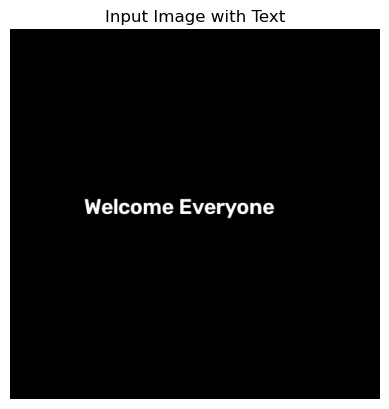
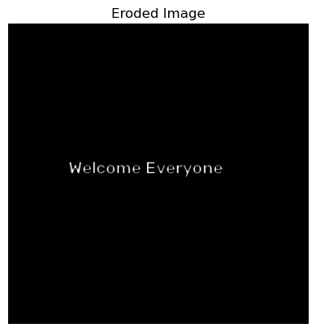
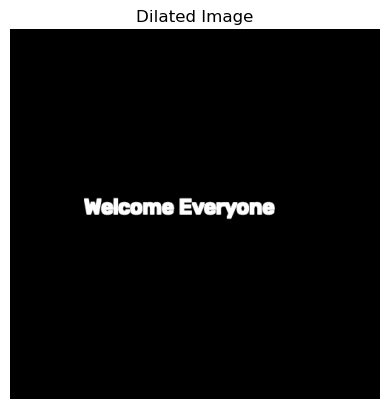

# Implementation of Erosion and Dilation Using OpenCV

## Aim

To write a Python program using OpenCV to perform morphological operations such as Erosion and Dilation on an image.

The program performs the following operations:

- Image Erosion
- Image Dilation

## Software Used

- Anaconda – Python 3.7+
- Jupyter Notebook / VS Code
- OpenCV (cv2)
- NumPy
- Matplotlib

## Algorithm

### Step 1:
Import the required libraries: OpenCV, NumPy, and Matplotlib.

### Step 2:
Create a blank image using NumPy.

### Step 3:
Insert text onto the image using OpenCV's `putText` function.

### Step 4:
Display the original image.

### Step 5:
Create a structuring element (kernel) of suitable size.

### Step 6: Image Erosion
- Apply the erosion operation using the created kernel.
- Remove pixels from the boundaries of foreground objects.
- Display the eroded image.

### Step 7: Image Dilation
- Apply the dilation operation using the same kernel.
- Add pixels to the boundaries of foreground objects.
- Display the dilated image.

### Step 8:
Compare the original, eroded, and dilated images.

## Program

### Import Libraries and Create Image with Text

```python
import cv2
import numpy as np
import matplotlib.pyplot as plt

# Create a blank image
image = np.zeros((500, 500, 3), dtype=np.uint8)

# Add text on the image using cv2.putText
font = cv2.FONT_HERSHEY_SIMPLEX
cv2.putText(image, 'Welcome Everyone', (100, 250), font, 1, (255, 255, 255), 2, cv2.LINE_AA)

# Display the input image
plt.imshow(cv2.cvtColor(image, cv2.COLOR_BGR2RGB))
plt.title("Input Image with Text")
plt.axis('off')
plt.show()
```

### Erosion

```python
# Create a simple square kernel (3x3)
kernel = np.ones((3, 3), np.uint8)

# Apply erosion (shrinking effect)
eroded_image = cv2.erode(image, kernel, iterations=1)

# Display the eroded image
plt.imshow(cv2.cvtColor(eroded_image, cv2.COLOR_BGR2RGB))
plt.title("Eroded Image")
plt.axis('off')
plt.show()
```

### Dilation

```python
# Apply dilation (expanding effect)
dilated_image = cv2.dilate(image, kernel, iterations=1)

# Display the dilated image
plt.imshow(cv2.cvtColor(dilated_image, cv2.COLOR_BGR2RGB))
plt.title("Dilated Image")
plt.axis('off')
plt.show()
```

## Output

### Original Image
- A blank image with white text "Welcome Everyone" is created.
- The image serves as the input for morphological processing.



### Erosion
- Original image is displayed.
- Eroded image is displayed.
- The thickness of the characters is reduced.
- Object boundaries shrink inward.



### Dilation
- Original image is displayed.
- Dilated image is displayed.
- The thickness of the characters increases.
- Object boundaries expand outward.



## Result

Thus, the morphological operations **Erosion** and **Dilation** are successfully implemented using OpenCV.